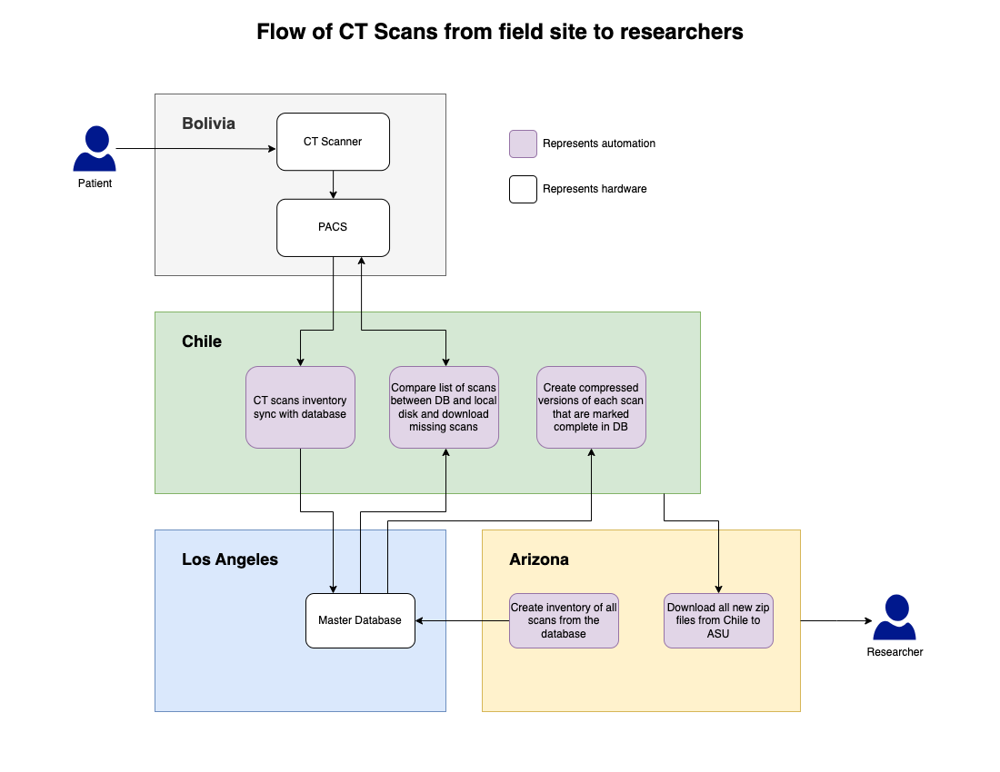

# DICOM Downloader
This repository contains 5 scripts that orchestrates the download of DICOMs from a given PACS to a local server using the PACS proctols (C-Find, C-Move). The scripts synchrnoize their states using a backend postgresql database though it can be modified to use a simple CSV file. The scripts are separated due to their reliance on different resources (cpu, upload or download) and thus can all be executed simultaneously to operate in an assembly line fashion. 

The output zip files are named as `<patient-id>_<delimiter><count of series>`. 
* `patient-id` is defined in the DICOM file itself
* `delimiter` is defined in the `config.json`, *(default is __seriesCount)*
* `count of series` is the number of series in the file. 

This means if the patient `AA-BB-CC` currently has 7 series then the zip file would have the name `AA-BB-CC__seriesCount7.zip`. If this patient gets another series in future then a new zip file named `AA-BB-CC__seriesCount8.zip` would automatically get created.

## Code overview
### Configuration
* `schema.sql` - Schema required for the database. Also contains optional triggers for the database to automatically update the `date_modified` columns.
* `config-sample.json` - This file contains credentials for PACS and PostgresQL as well as the paths for download. This file needs to be filled in with valid credentials and renamed to `config.json` before starting any other scripts.

### Scripts
* `automate/01_db_insert_patients.py` - Queries PACS for all patients and any patient IDs that match a predetermined criteria get added to the PostgresQL database. The criteria is determined by the function `detect_thlhp_patient()`
* `automate/02_db_insert_studies.py` - Fetches all patient_ids from the database, queries the PACS for all studies associated with the patient_ids and adds them to the database. 
* `automate/03_db_insert_series.py` - Fetches all study_ids from the database, queries all series associated with them and populates the database with them.
* `automate/04_db_downloading_dicoms.py` - Queries the database for any series that has not been marked as `complete` in the column `download_status` and downloads them. Multiple instances of the script can be executed to download multiple DICOMs in parallel.
* `automate/05_db_compress_dicoms.smk` - [Snakemake](https://snakemake.github.io/) script that queries the database for all patients where all of their series have been downloaded and then creates a compressed file containing all the series for that patient.
* `automate/06_validate_slices.py` - Optional script that validates if the total number of downloaded slices match the number of slices for each series in the database.
* `automate/07_dicom_inventory_generator.py` - Creates a CSV file of all series, studies, patients in the database. 

## Automation

Use `crontab -e` to schedule the scripts. Sample bash driver files are provided in the `automate` directory with optional heartbeat integeration. The badges at top of this readme provide current status of the automations. 
* `pacs_to_thlhp_db_postgresql` - Status of scripts 01-03
* `dicoms_pacs_to_chile` - Status of script 04
* `smk-compressor-chile-dicoms` - Status of script 05
* `dicoms_chile_to_asu` - Status of rsync script that copies all compressed files from Chile to ASU storage and makes it available on Globus. 
* `dicom_inventory_generator` - Status of script 07. Currently runs on ASU servers and the report is created in the same directory as the DICOMs. 

## Current implementation notes
* The internet connection in Bolivia resets every day at 3am local time which the downloader script can now handle. If not handle, it causes the downloading script to go in an infinite loop. 
* The PACS can support ~700 requests a minute, anything beyond that causes all connections to be reset. 

## Future todo
* ~~Make the snakemake script recreate the zip file if new series are detected for a patient.~~ Completed.